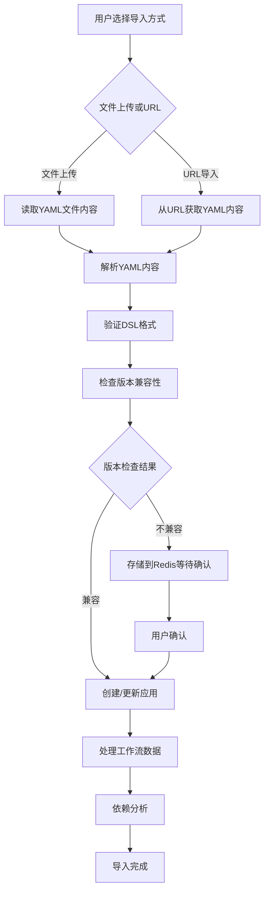

# Dify社区版DSL文件导入功能技术文档

## 1. 功能概述

Dify的DSL（Domain Specific Language）导入功能允许用户将应用配置以YAML格式导入到系统中，支持工作流应用（Workflow）和高级聊天应用（Advanced Chat）的导入。该功能支持两种导入方式：文件上传和URL导入。

## 2. 系统架构

### 2.1 核心组件

**后端核心组件：**
- `AppDslService`：DSL导入导出的核心服务类
- `AppImportApi`：处理DSL导入的HTTP控制器
- `WorkflowService`：工作流管理服务
- `DependenciesAnalysisService`：依赖分析服务

**前端核心组件：**
- `CreateFromDSLModal`：DSL导入的主要用户界面
- `Uploader`：文件上传组件的
- `DSLConfirmModal`：版本确认对话框

### 2.2 关键文件结构

```
api/
├── services/
│   ├── app_dsl_service.py          # DSL导入导出核心服务
│   └── workflow_service.py         # 工作流服务
├── controllers/console/app/
│   ├── app_import.py              # 导入API控制器
│   └── app.py                     # 应用管理控制器
├── core/tools/utils/
│   └── yaml_utils.py              # YAML工具函数
└── fields/
    └── app_fields.py              # 数据字段定义

web/app/components/app/create-from-dsl-modal/
├── index.tsx                      # 主要导入界面
├── uploader.tsx                   # 文件上传组件
└── dsl-confirm-modal.tsx          # 确认对话框
```

## 3. DSL导入流程详细分析

### 3.1 导入流程图



### 3.2 关键步骤说明

#### 步骤1：接收导入请求
- 支持两种模式：`yaml-content`（文件内容）和`yaml-url`（URL地址）
- 对文件大小进行限制（最大10MB）
- 验证URL格式和安全性

#### 步骤2：YAML解析和验证
```python
# 关键代码片段
data = yaml.safe_load(content)
if not isinstance(data, dict):
    return Import(status=ImportStatus.FAILED, error="Invalid YAML format")

# 版本验证和修复
if not data.get("version"):
    data["version"] = "0.1.0"
if not data.get("kind") or data.get("kind") != "app":
    data["kind"] = "app"
```

#### 步骤3：版本兼容性检查
- 当前DSL版本：`0.2.0`
- 版本比较逻辑：
  - 导入版本 > 当前版本 → `PENDING`（需要确认）
  - 导入版本主版本 < 当前主版本 → `PENDING`
  - 导入版本次版本 < 当前次版本 → `COMPLETED_WITH_WARNINGS`
  - 其他情况 → `COMPLETED`

#### 步骤4：应用创建/更新
- 支持创建新应用或覆盖现有应用
- 只有Workflow和Advanced Chat应用可以被覆盖
- 自动处理应用元数据（名称、描述、图标等）

#### 步骤5：工作流数据处理
- 解析工作流图结构
- 处理环境变量和对话变量
- 知识库数据集ID的加密/解密处理
- 节点配置同步

#### 步骤6：依赖分析
- 提取工具依赖
- 提取模型提供商依赖
- 生成依赖清单
- 检查泄露的依赖项

## 4. API接口文档

### 4.1 DSL导入接口

**接口地址：** `POST /console/api/apps/import`

**请求参数：**
```json
{
  "mode": "yaml-content | yaml-url",
  "yaml_content": "string (可选，mode为yaml-content时必填)",
  "yaml_url": "string (可选，mode为yaml-url时必填)",
  "name": "string (可选，应用名称)",
  "description": "string (可选，应用描述)",
  "icon_type": "emoji | link (可选)",
  "icon": "string (可选)",
  "icon_background": "string (可选)",
  "app_id": "string (可选，覆盖现有应用时使用)"
}
```

**响应数据：**
```json
{
  "id": "string (导入ID)",
  "status": "completed | completed-with-warnings | pending | failed",
  "app_id": "string (应用ID)",
  "app_mode": "string (应用模式)",
  "current_dsl_version": "string (当前系统DSL版本)",
  "imported_dsl_version": "string (导入的DSL版本)",
  "error": "string (错误信息，失败时提供)"
}
```

**状态码：**
- `200`：导入成功
- `202`：等待确认（版本不兼容）
- `400`：导入失败

### 4.2 确认导入接口

**接口地址：** `POST /console/api/apps/import/{import_id}/confirm`

**请求参数：** 无

**响应数据：** 同导入接口

### 4.3 依赖检查接口

**接口地址：** `GET /console/api/apps/{app_id}/import/check-dependencies`

**响应数据：**
```json
{
  "leaked_dependencies": [
    {
      "type": "string",
      "value": "object",
      "current_identifier": "string"
    }
  ]
}
```

## 5. DSL格式规范

### 5.1 标准DSL结构
```yaml
version: "0.2.0"
kind: "app"
app:
  name: "应用名称"
  mode: "workflow | advanced-chat"
  icon: "🤖"
  icon_background: "#FFEAD5"
  description: "应用描述"
  use_icon_as_answer_icon: false

workflow:
  graph:
    nodes: []
    edges: []
  features: {}
  environment_variables: []
  conversation_variables: []

dependencies:
  - type: "tool"
    value: "provider_id"
  - type: "model_provider"
    value: "provider_name"
```

### 5.2 工作流节点类型支持
- `start`：开始节点
- `llm`：大语言模型节点
- `tool`：工具节点
- `knowledge-retrieval`：知识检索节点
- `question-classifier`：问题分类节点
- `parameter-extractor`：参数提取节点
- `http-request`：HTTP请求节点
- `end`：结束节点

## 6. 前端用户界面

### 6.1 导入模态框功能
- **标签页切换**：文件上传 / URL导入
- **文件拖拽上传**：支持`.yaml`和`.yml`文件
- **实时验证**：文件格式和大小检查
- **键盘快捷键**：`Cmd/Ctrl + Enter`快速导入

### 6.2 版本确认对话框
- 当DSL版本不兼容时显示
- 显示导入版本和系统版本对比
- 提供强制导入选项

### 6.3 错误处理
- 文件格式错误提示
- 网络请求失败处理
- 导入状态实时反馈

## 7. 安全和限制

### 7.1 安全措施
- **文件大小限制**：最大10MB
- **文件类型限制**：只允许YAML格式
- **URL安全检查**：SSRF防护
- **权限验证**：只有编辑者权限才能导入
- **数据加密**：知识库ID使用AES加密

### 7.2 业务限制
- 只支持Workflow和Advanced Chat应用的覆盖
- 需要当前租户下的应用权限
- 应用数量限制检查

## 8. 错误码和异常处理

### 8.1 常见错误码
- `Invalid YAML format`：YAML格式错误
- `Missing app data in YAML content`：缺少应用数据
- `App not found`：指定的应用不存在
- `Only workflow or advanced chat apps can be overwritten`：应用类型不支持覆盖
- `File size exceeds the limit of 10MB`：文件大小超限

### 8.2 异常处理机制
- Redis存储临时导入数据（10分钟过期）
- 数据库事务保证数据一致性
- 详细的日志记录用于问题排查

## 9. 依赖管理

### 9.1 依赖类型
- **工具依赖**：自定义工具提供商
- **模型依赖**：LLM提供商
- **重排序模型**：知识检索重排序

### 9.2 依赖检查流程
1. 从DSL中提取依赖信息
2. 生成最新版本依赖清单
3. 检查租户下缺失的依赖
4. 提供泄露依赖报告

## 10. 核心代码分析

### 10.1 AppDslService核心方法

#### import_app方法
```python
def import_app(
    self,
    *,
    account: Account,
    import_mode: str,
    yaml_content: Optional[str] = None,
    yaml_url: Optional[str] = None,
    name: Optional[str] = None,
    description: Optional[str] = None,
    icon_type: Optional[str] = None,
    icon: Optional[str] = None,
    icon_background: Optional[str] = None,
    app_id: Optional[str] = None,
) -> Import:
    """Import an app from YAML content or URL."""
```

功能：
- 验证导入模式
- 获取YAML内容（文件或URL）
- 解析和验证YAML格式
- 版本兼容性检查
- 创建或更新应用

#### _create_or_update_app方法
```python
def _create_or_update_app(
    self,
    *,
    app: Optional[App],
    data: dict,
    account: Account,
    name: Optional[str] = None,
    description: Optional[str] = None,
    icon_type: Optional[str] = None,
    icon: Optional[str] = None,
    icon_background: Optional[str] = None,
    dependencies: Optional[list[PluginDependency]] = None,
) -> App:
    """Create a new app or update an existing one."""
```

功能：
- 处理应用元数据
- 初始化工作流配置
- 处理环境变量和对话变量
- 依赖管理

### 10.2 版本兼容性检查逻辑

```python
def _check_version_compatibility(imported_version: str) -> ImportStatus:
    """Determine import status based on version comparison"""
    try:
        current_ver = version.parse(CURRENT_DSL_VERSION)
        imported_ver = version.parse(imported_version)
    except version.InvalidVersion:
        return ImportStatus.FAILED

    # If imported version is newer than current, always return PENDING
    if imported_ver > current_ver:
        return ImportStatus.PENDING

    # If imported version is older than current's major, return PENDING
    if imported_ver.major < current_ver.major:
        return ImportStatus.PENDING

    # If imported version is older than current's minor, return COMPLETED_WITH_WARNINGS
    if imported_ver.minor < current_ver.minor:
        return ImportStatus.COMPLETED_WITH_WARNINGS

    # If imported version equals or is older than current's micro, return COMPLETED
    return ImportStatus.COMPLETED
```

### 10.3 依赖提取逻辑

#### 从工作流图中提取依赖
```python
@classmethod
def _extract_dependencies_from_workflow_graph(cls, graph: Mapping) -> list[str]:
    """Extract dependencies from workflow graph"""
    dependencies = []
    for node in graph.get("nodes", []):
        try:
            typ = node.get("data", {}).get("type")
            match typ:
                case NodeType.TOOL.value:
                    tool_entity = ToolNodeData(**node["data"])
                    dependencies.append(
                        DependenciesAnalysisService.analyze_tool_dependency(tool_entity.provider_id),
                    )
                case NodeType.LLM.value:
                    llm_entity = LLMNodeData(**node["data"])
                    dependencies.append(
                        DependenciesAnalysisService.analyze_model_provider_dependency(llm_entity.model.provider),
                    )
                # ... 其他节点类型处理
        except Exception as e:
            logger.exception("Error extracting node dependency", exc_info=e)
    return dependencies
```

### 10.4 前端导入逻辑

#### DSL导入主要流程
```typescript
const onCreate: MouseEventHandler = async () => {
  if (currentTab === CreateFromDSLModalTab.FROM_FILE && !currentFile)
    return
  if (currentTab === CreateFromDSLModalTab.FROM_URL && !dslUrlValue)
    return
    
  try {
    let response
    
    if (currentTab === CreateFromDSLModalTab.FROM_FILE) {
      response = await importDSL({
        mode: DSLImportMode.YAML_CONTENT,
        yaml_content: fileContent || '',
      })
    }
    if (currentTab === CreateFromDSLModalTab.FROM_URL) {
      response = await importDSL({
        mode: DSLImportMode.YAML_URL,
        yaml_url: dslUrlValue || '',
      })
    }
    
    const { id, status, app_id, app_mode, imported_dsl_version, current_dsl_version } = response
    if (status === DSLImportStatus.COMPLETED || status === DSLImportStatus.COMPLETED_WITH_WARNINGS) {
      // 导入成功处理
    }
    else if (status === DSLImportStatus.PENDING) {
      // 版本不兼容，需要确认
    }
  } catch (e) {
    // 错误处理
  }
}
```

## 11. 总结

Dify的DSL导入功能是一个完整的企业级应用导入解决方案，具有以下特点：

1. **完整的导入流程**：从前端用户界面到后端业务逻辑，提供了完整的导入体验
2. **版本兼容性管理**：智能处理不同版本的DSL文件，确保向后兼容
3. **安全性保障**：多层安全检查，防止恶意文件和SSRF攻击
4. **依赖管理**：自动分析和管理应用依赖，确保导入的应用能正常运行
5. **错误处理**：完善的错误处理和用户反馈机制
6. **扩展性设计**：模块化的设计便于功能扩展和维护

该功能为Dify平台提供了强大的应用迁移和分享能力，用户可以轻松地导入和部署各种工作流应用。

---

*本文档基于Dify社区版源码分析生成，版本信息以实际代码为准。*